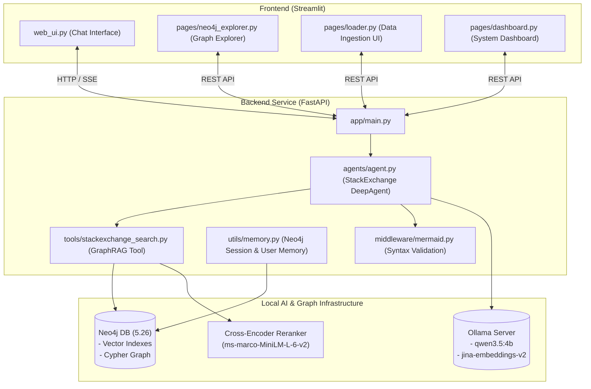

# 🍭 Lolly RAG: Agentic GraphRAG System for Technical Q&A

**Lolly RAG** is an end-to-end, high-performance **Agentic Graph Retrieval-Augmented Generation (GraphRAG)** application. It integrates local LLMs (via Ollama), Neo4j graph database vector indexing, and StackExchange knowledge bases to provide context-aware, verifiable engineering answers and dynamic graph visualizations.

---

## 🏗 Architecture Overview



---

## 🌟 Key Features

* **🤖 Autonomous Agentic GraphRAG**: Powered by [`deepagents`](file:///home/lolli/projects/agentic-graphrag/lolly-rag/backend/agents/agent.py) and LangChain, utilizing hierarchical tool execution protocols to search knowledge graphs or fallback gracefully to internal model knowledge.
* **⚡ Vector + Graph Hybrid Search**: Combines Neo4j vector cosine similarity indexes on `Question`, `Answer`, `Tag`, and `User` nodes with Cypher graph relationship traversals and GPU-accelerated Cross-Encoder reranking (`ms-marco-MiniLM-L-6-v2`).
* **📥 Dynamic Data Ingestion**: Live fetching from StackExchange / StackOverflow API with automatic node creation, vector embedding generation (`jina-embeddings-v2-base-en`), and relationship wiring in Neo4j.
* **📊 Visual Graph Explorer & Analytics**: Interactive PyVis network visualizers, database summaries, entity count distribution charts, and Cypher query execution logs directly in Streamlit.
* **🧠 Persistent Graph Memory & Session Repair**: Chat history and user sessions are stored directly in Neo4j graph nodes. Startup routines automatically repair missing session relationships (`HAS_MESSAGE`).
* **🔮 Robust Middleware Pipeline**: Custom [`MermaidValidationMiddleware`](file:///home/lolli/projects/agentic-graphrag/lolly-rag/backend/middleware/mermaid.py) ensures valid syntax for streamed workflow and architectural diagrams.

---

## 📁 Repository Structure

```
lolly-rag/
├── backend/
│   ├── agents/
│   │   └── agent.py              # Agent initialization & system prompts
│   ├── app/
│   │   └── main.py               # FastAPI application & REST endpoints
│   ├── middleware/
│   │   ├── in_built.py           # Tool call state utilities
│   │   └── mermaid.py            # Mermaid diagram validation middleware
│   ├── setup/
│   │   ├── init_config.py        # Ollama LLM, embedding & Neo4j vector index setups
│   │   └── neo4j_query_saved_cypher_2026-8-22.csv
│   ├── tools/
│   │   ├── stackexchange_search.py  # GraphRAG search & StackExchange API importer
│   │   └── template.py           # Tool templates & Cypher chains
│   ├── utils/
│   │   ├── dashboard.py          # Neo4j query helpers & statistics
│   │   ├── memory.py             # User and chat session graph operations
│   │   └── utils.py              # Environment & container diagnostic tools
│   ├── Dockerfile
│   └── requirements.txt
├── frontend/
│   ├── pages/
│   │   ├── dashboard.py          # Dashboard analytics page
│   │   ├── loader.py             # StackExchange data loader page
│   │   └── neo4j_explorer.py     # Interactive Neo4j graph graph viewer
│   ├── utils/
│   │   └── ui_utils.py           # Custom Streamlit UI components & layout helpers
│   ├── web_ui.py                 # Main Streamlit chat app
│   ├── Dockerfile
│   └── requirements.txt
├── docker-compose.yml             # Containerized services (Ollama, Neo4j, Backend, Frontend)
├── pyproject.toml                 # Project metadata & pyright setup
├── requirements.txt               # Full Python dependency specifications
└── run.sh                         # Unified launch script for FastAPI & Streamlit
```

---

## 🚀 Quick Start

### 1. Prerequisites

* **Python 3.13+** (or standard virtual environment manager like `uv` or `venv`)
* **Docker & Docker Compose** (with NVIDIA Container Toolkit for GPU acceleration if available)
* **Ollama** running locally or via Docker

### 2. Environment Setup

Create or update your `.env` file in the root directory:

```env
NEO4J_URL="bolt://localhost:7687"
NEO4J_USERNAME="neo4j"
NEO4J_PASSWORD="password"

OLLAMA_BASE_URL="http://localhost:11434"
EMBEDDING_MODEL="jina/jina-embeddings-v2-base-en:latest"

BACKEND_URL="http://localhost:8000"
STACKEXCHANGE_API_KEY="your_optional_stackexchange_key"
```

### 3. Option A: Run Locally via `run.sh`

Activate your environment and run the startup script:

```bash
chmod +x run.sh
./run.sh
```

This starts:
* **FastAPI Backend**: `http://localhost:8000` (Docs available at `http://localhost:8000/docs`)
* **Streamlit Frontend**: `http://localhost:8501`

### 4. Option B: Run with Docker Compose

To spin up all services including Neo4j, Ollama, FastAPI, and Streamlit:

```bash
docker-compose up --build -d
```

Service Ports:
* **Streamlit Frontend**: `http://localhost:8501`
* **FastAPI Backend**: `http://localhost:8000`
* **Neo4j Browser**: `http://localhost:7474`
* **Ollama API**: `http://localhost:11434`

---

## 🛠 Model Configuration

Model definitions and LLM parameters are set in [`backend/setup/init_config.py`](file:///home/lolli/projects/agentic-graphrag/lolly-rag/backend/setup/init_config.py):

| Role | Default Model / Class | Function |
| :--- | :--- | :--- |
| **Answer LLM** | `qwen3.5:4b` | Agent reasoning, tool orchestration & answer generation |
| **Cypher LLM** | `qwen3.5:4b` (temp=0.0) | Deterministic text-to-Cypher query generation |
| **Embedding Model** | `jina-embeddings-v2-base-en` | 768-dim vector embeddings for Neo4j Vector Indexes |
| **Reranker Model** | `ms-marco-MiniLM-L-6-v2` | PyTorch GPU cross-encoder candidate re-scoring |
| **Summarizer LLM** | `qwen3.5:0.8b` | Historical chat context condensation |

---

## 🌐 API Reference

### System & Health
* `GET /`: API status welcome message
* `GET /health`: Health check timestamp
* `GET /config`: Runtime configuration details (Ollama model, Neo4j status)

### Chat & Users
* `GET /users`: Retrieve all registered users
* `GET /user/{user_id}/chats`: Retrieve sessions for a specified user
* `GET /chat/{session_id}`: Fetch message history for a session
* `POST /query`: Primary agent query endpoint (supports SSE streaming)

### Ingestion & Graph Analytics
* `POST /ingest/stackexchange`: Trigger background StackExchange data fetch & graph ingestion
* `GET /stats/summary`: Database node & relationship metrics
* `GET /stats/entity-counts`: Categorical node count breakdowns
* `POST /graph/search`: Full-text & Cypher search on knowledge nodes
* `GET /graph/sample`: Graph network topology sample for visualization

---

## 📄 License

This project is open-source and available under the MIT License.
