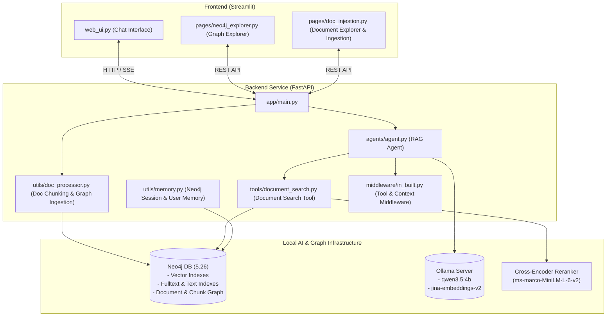

# 🍭 Lolly RAG: Agentic GraphRAG System for Technical Documents & Q&A

**Lolly RAG** is an end-to-end, high-performance **Agentic Graph Retrieval-Augmented Generation (GraphRAG)** application. It integrates local LLMs (via Ollama), Neo4j graph database vector and hybrid indexing, and document knowledge bases to provide context-aware, verifiable engineering answers and dynamic graph visualizations.

---

## 🏗 Architecture Overview



---

## 🌟 Key Features

| Feature | Description | Key Tech & Highlights |
| :--- | :--- | :--- |
| **🤖 Autonomous Agentic GraphRAG** | Powered by [`deepagents`](file:///home/lolli/projects/agentic-graphrag/lolly-rag/backend/agents/agent.py) and LangChain, utilizing hierarchical tool execution protocols to search document knowledge graphs or fallback gracefully to internal model knowledge. | LangChain, `deepagents`, Ollama LLMs |
| **⚡ Vector + Graph Hybrid Search** | Combines Neo4j vector cosine similarity indexes on `DocumentChunk` nodes with fulltext keyword indexes on documents, text indexes, metadata matching, and GPU-accelerated Cross-Encoder reranking. | Neo4j Vector Indexes, Fulltext Search, `ms-marco-MiniLM-L-6-v2` |
| **📥 Multi-Format Document Ingestion** | Ingestion pipeline for PDFs, Word `.docx`, Markdown `.md`, and plain text `.txt` with automatic node creation, chunking, vector embedding generation, and relationship wiring `(Document)-[:HAS_CHUNK]->(DocumentChunk)`. | PDF / DOCX / MD / TXT, `jina-embeddings-v2-base-en` |
| **📊 Visual Graph Explorer & Analytics** | Interactive PyVis network visualizers, database summaries, entity count distribution metrics, and graph sampling directly in Streamlit. | PyVis Network Visualizer, Streamlit Analytics |
| **🧠 Persistent Graph Memory & Session Repair** | Chat history and user sessions are stored directly in Neo4j graph nodes. Startup routines automatically repair missing session relationships (`HAS_MESSAGE`). | Neo4j Graph Sessions, Auto-Healing Graph Routines |
| **🔮 Robust Middleware Pipeline** | Integrated [`middleware/in_built.py`](file:///home/lolli/projects/agentic-graphrag/lolly-rag/backend/middleware/in_built.py) handling automatic summarization, tool call limits, contextual trimming, and tool retry mechanisms. | Summarization, Context Editing, Tool Call Limits |

---

## 📁 Repository Structure

```
lolly-rag/
├── backend/
│   ├── agents/
│   │   └── agent.py              # Agent initialization & system prompts
│   ├── app/
│   │   └── main.py               # FastAPI application & REST endpoints
│   ├── middleware/
│   │   └── in_built.py           # Context & tool call middleware
│   ├── setup/
│   │   └── init_config.py        # Ollama LLM, embedding & Neo4j vector index setups
│   ├── tools/
│   │   └── document_search.py    # Multi-index hybrid search & Cross-Encoder reranking
│   ├── utils/
│   │   ├── dashboard.py          # Neo4j query helpers & graph statistics
│   │   ├── doc_processor.py      # Document parser, chunker & graph builder
│   │   ├── memory.py             # User and chat session graph operations
│   │   └── utils.py              # Environment & diagnostic tools
│   ├── Dockerfile
│   └── requirements.txt
├── frontend/
│   ├── pages/
│   │   ├── doc_injestion.py      # Document file explorer & upload page
│   │   └── neo4j_explorer.py     # Interactive Neo4j graph viewer
│   ├── utils/
│   │   └── ui_utils.py           # Custom Streamlit UI components & layout helpers
│   ├── web_ui.py                 # Main Streamlit chat app
│   ├── Dockerfile
│   └── requirements.txt
├── docker-compose.yml             # Containerized services (Ollama, Neo4j, Backend, Frontend)
├── pyproject.toml                 # Project metadata & pyright setup
├── requirements.txt               # Full Python dependency specifications
└── run.sh                         # Unified launch script for FastAPI & Streamlit
```

---

## 🚀 Quick Start

### 1. Prerequisites

* **Python 3.13+**
* [**uv**](https://docs.astral.sh/uv/) (recommended fast Python package manager)
* **Docker & Docker Compose** (for running Neo4j and optional containerized Ollama)
* **Ollama** running locally or via Docker

---

### 2. Local Setup with `uv` (Recommended)

#### Step 1: Install `uv`
If you do not have `uv` installed, install it via:

```bash
# macOS / Linux
curl -LsSf https://astral.sh/uv/install.sh | sh

# Windows
powershell -ExecutionPolicy ByPass -c "irm https://astral.sh/uv/install.ps1 | iex"
```

#### Step 2: Clone and Sync Environment
Clone the repository, create a virtual environment, and sync dependencies using `uv`:

```bash
git clone <repository-url>
cd lolly-rag

# Create virtual environment with Python 3.13
uv venv --python 3.13

# Activate virtual environment
source .venv/bin/activate       # On Windows: .venv\Scripts\activate

# Install and sync dependencies from uv.lock / pyproject.toml
uv sync
```

#### Step 3: Configure Environment Variables
Copy `.env.example` to `.env` and verify database and Ollama endpoints:

```bash
cp .env.example .env
```

Default `.env` configuration:
```env
NEO4J_URL="bolt://localhost:7687"
NEO4J_USERNAME="neo4j"
NEO4J_PASSWORD="password"

OLLAMA_BASE_URL="http://localhost:11434"
EMBEDDING_MODEL="jina/jina-embeddings-v2-base-en:latest"

BACKEND_URL="http://localhost:8000"
```

#### Step 4: Pull Required Ollama Models
Ensure Ollama is running and download the models:

```bash
ollama pull qwen3.5:4b
ollama pull jina/jina-embeddings-v2-base-en:latest
ollama pull qwen3.5:0.8b
```

#### Step 5: Start Neo4j
Start a local Neo4j database container:

```bash
docker run -d \
  --name lolly-neo4j \
  -p 7474:7474 -p 7687:7687 \
  -e NEO4J_AUTH=neo4j/password \
  neo4j:5.26
```

#### Step 6: Launch Applications

**Option A: Unified Launch Script**
```bash
chmod +x run.sh
./run.sh
```

**Option B: Manual / `uv run` Launch**
```bash
# Terminal 1: FastAPI Backend
cd backend && uv run uvicorn app.main:app --host 0.0.0.0 --port 8000 --reload

# Terminal 2: Streamlit Frontend
cd frontend && uv run streamlit run web_ui.py --server.address 0.0.0.0
```

Access the interfaces:
* **Streamlit Web UI**: `http://localhost:8501`
* **FastAPI Docs**: `http://localhost:8000/docs`
* **Neo4j Browser**: `http://localhost:7474`

---

### 3. Alternative: Run with Docker Compose

To spin up all services (Neo4j, Ollama, FastAPI backend, and Streamlit frontend) in containers:

```bash
docker-compose up --build -d
```

Service Ports:
* **Streamlit Frontend**: `http://localhost:8501`
* **FastAPI Backend**: `http://localhost:8000`
* **Neo4j Browser**: `http://localhost:7474`
* **Ollama API**: `http://localhost:11434`


---

## 🛠 Model Configuration

Model definitions and LLM parameters are set in [`backend/setup/init_config.py`](file:///home/lolli/projects/agentic-graphrag/lolly-rag/backend/setup/init_config.py):

| Role | Default Model / Class | Function |
| :--- | :--- | :--- |
| **Answer LLM** | `qwen3.5:4b` | Agent reasoning, tool orchestration & answer generation |
| **Embedding Model** | `jina-embeddings-v2-base-en` | 768-dim vector embeddings for Neo4j Vector Indexes |
| **Reranker Model** | `ms-marco-MiniLM-L-6-v2` | PyTorch GPU cross-encoder candidate re-scoring |
| **Summarizer LLM** | `qwen3.5:0.8b` | Historical chat context condensation |

---

## 🌐 API Reference

### System & Health
* `GET /`: API status welcome message
* `GET /health`: Health check timestamp
* `GET /config`: Runtime configuration details (Ollama model, Neo4j status)

### Chat & Users
* `GET /users`: Retrieve all registered users
* `GET /user/{user_id}/chats`: Retrieve sessions for a specified user
* `GET /chat/{session_id}`: Fetch message history for a session
* `POST /agent/ask`: Primary agent query endpoint (supports SSE streaming)

### Document Ingestion & Management
* `POST /ingest/documents`: Upload and chunk document (`.pdf`, `.docx`, `.txt`, `.md`)
* `GET /ingest/documents`: List uploaded documents metadata
* `GET /ingest/documents/{doc_id}/chunks`: Retrieve chunks for a document
* `PUT /ingest/documents/{doc_id}`: Update document description / folder metadata
* `DELETE /ingest/documents/{doc_id}`: Delete document and associated chunks

### Analytics & Graph
* `GET /stats/summary`: Database document, user, session, and message metrics
* `GET /stats/entity_counts`: Entity and relationship type counts
* `GET /graph/search`: Search knowledge graph nodes
* `POST /graph/sample`: Graph network topology sample for visualization

---

## 📄 License

This project is open-source and available under the MIT License.

