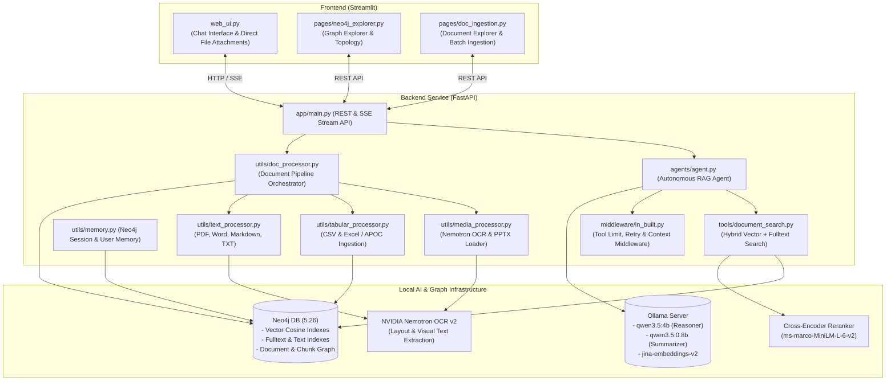

# 🍭 Lolly RAG: Agentic GraphRAG System for Knowledge Base

**Lolly RAG** is an end-to-end, high-performance **Agentic Graph Retrieval-Augmented Generation (GraphRAG)** system. It integrates local LLMs (via Ollama), Neo4j graph database vector and hybrid indexing, GPU-accelerated Cross-Encoder reranking, and **NVIDIA Nemotron OCR v2** to provide context-aware, verifiable engineering answers, multi-modal file ingestion, and dynamic graph visualizations.

---

## 🏗 Architecture Overview



---

## 🌟 Key Features

| Feature                                        | Description                                                                                                                                                                                                                                                                                         | Key Tech & Highlights                                                 |
| :--------------------------------------------- | :-------------------------------------------------------------------------------------------------------------------------------------------------------------------------------------------------------------------------------------------------------------------------------------------------- | :-------------------------------------------------------------------- |
| **🤖 Autonomous Agentic GraphRAG**              | Powered by`deepagents` and LangChain, utilizing hierarchical tool execution protocols to search document knowledge graphs or fallback gracefully to internal model knowledge.                                                                                                                       | LangChain,`deepagents`, Ollama (`qwen3.5:4b`)                         |
| **👁️ NVIDIA Nemotron OCR v2**                   | High-accuracy deep learning OCR pipeline replacing legacy Tesseract. Automatically transcribes text, tables, diagrams, and visual layout from images and scanned PDFs into structured searchable chunks.                                                                                            | `nemotron-ocr-v2`, `torchvision`, `shapely`, GPU-accelerated          |
| **📎 Native In-Chat File Attachments**          | Drag-and-drop or select multiple documents/media directly inside the chat bar. Automatically ingests attachments into the knowledge graph under "Chat Uploads" before querying the agent.                                                                                                           | Streamlit`st.chat_input(accept_file="multiple")`, SSE status feedback |
| **📊 Multi-Modal Ingestion Pipeline**           | Specialized loaders for diverse formats: Spreadsheets (`.xlsx`, `.xls`), CSV (`.csv` via APOC/chunking), PowerPoint (`.pptx`, `.ppt` with slide/table/notes extraction), PDF (with OCR fallback), Word (`.docx`), Markdown (`.md`), and images (`.png`, `.jpg`, `.jpeg`, `.webp`, `.bmp`, `.tiff`). | `python-pptx`, `openpyxl`, `pandas`, `pypdf`, `Pillow`                |
| **⚡ Vector + Graph Hybrid Search**             | Combines Neo4j vector cosine similarity indexes on`DocumentChunk` nodes with fulltext keyword indexes, metadata matching, and GPU-accelerated Cross-Encoder reranking.                                                                                                                              | Neo4j Vector Indexes, Fulltext Search,`ms-marco-MiniLM-L-6-v2`        |
| **🔍 Smart Intent Detection**                   | Search tool automatically detects visual/diagram, presentation/slide, and tabular dataset intent from natural user queries, routing to specialized chunk types (`[Media: Image & OCR Text]`, `[Dataset: Tabular Records]`).                                                                         | Regex Query Classifier, Metadata Filtering                            |
| **📈 Visual Graph Explorer & Analytics**        | Interactive PyVis network visualizers, database summaries, entity count distribution metrics, and graph sampling directly in Streamlit.                                                                                                                                                             | PyVis Network Visualizer, Streamlit Analytics                         |
| **🧠 Persistent Graph Memory & Session Repair** | Chat history and user sessions are stored directly in Neo4j graph nodes. Startup routines automatically repair missing session relationships (`HAS_MESSAGE`).                                                                                                                                       | Neo4j Graph Sessions, Auto-Healing Graph Routines                     |
| **🔮 Robust Middleware Pipeline**               | Integrated`middleware/in_built.py` handling automatic summarization, tool call limits (3 runs), contextual trimming, and tool retry mechanisms.                                                                                                                                                     | Summarization, Context Editing, Tool Call Limits & Retries            |

---

## 📁 Repository Structure

```
lolly-rag/
├── backend/
│   ├── agents/
│   │   └── agent.py              # Agent initialization & system prompts (Document-First Rule)
│   ├── app/
│   │   └── main.py               # FastAPI application, REST endpoints & SSE streaming
│   ├── middleware/
│   │   └── in_built.py           # Context, tool limit & retry middleware
│   ├── setup/
│   │   └── init_config.py        # Ollama LLM, Nemotron OCR v2 & Neo4j vector configs
│   ├── tools/
│   │   └── document_search.py    # Multi-index hybrid search & Cross-Encoder reranking
│   ├── utils/
│   │   ├── dashboard.py          # Neo4j query helpers & graph statistics
│   │   ├── doc_processor.py      # Main document ingestion & dispatch orchestrator
│   │   ├── media_processor.py    # PowerPoint (.pptx) & Nemotron OCR image loaders
│   │   ├── tabular_processor.py  # CSV & Excel (.xlsx, .xls) chunking & APOC ingestion
│   │   ├── text_processor.py     # PDF (with OCR fallback), DOCX, MD & TXT loaders
│   │   ├── memory.py             # User and chat session graph operations
│   │   └── utils.py              # Environment & diagnostic tools
│   ├── Dockerfile                # Python 3.12 image with CUDA runtime dependencies
│   └── requirements.txt
├── frontend/
│   ├── pages/
│   │   ├── doc_ingestion.py      # Document explorer, folder manager & batch upload page
│   │   └── neo4j_explorer.py     # Interactive Neo4j graph viewer & analytics
│   ├── utils/
│   │   ├── doc_utils.py          # Frontend document API helper routines
│   │   └── ui_utils.py           # Streamlit UI styling & component helpers
│   ├── web_ui.py                 # Main Streamlit chat UI with native multi-file uploads
│   ├── Dockerfile
│   └── requirements.txt
├── docker-compose.yml             # Full-stack composition (Ollama, Neo4j, Backend, Frontend)
├── pyproject.toml                 # Project dependencies & Python >=3.12 requirement
├── run.sh                         # Launch script with model caching (Reranker + Nemotron OCR)
└── .env.example                   # Environment configuration template
```

---

## 🚀 Quick Start

### 1. Prerequisites

* **Python 3.12+** (required for PyTorch, torchvision, and Nemotron OCR v2 compatibility)
* [**uv**](https://docs.astral.sh/uv/) (recommended fast Python package manager)
* **Docker & Docker Compose** (for running Neo4j and optional containerized services)
* **Ollama** running locally or via Docker
* **NVIDIA GPU** with CUDA support (recommended for optimal Nemotron OCR & Cross-Encoder inference)

---

### 2. Local Setup with `uv` (Recommended)

#### Step 1: Install `uv`

```bash
# macOS / Linux
curl -LsSf https://astral.sh/uv/install.sh | sh

# Windows
powershell -ExecutionPolicy ByPass -c "irm https://astral.sh/uv/install.ps1 | iex"
```

#### Step 2: Clone and Sync Environment

```bash
git clone <repository-url>
cd lolly-rag

# Create virtual environment with Python 3.12
uv venv --python 3.12

# Activate virtual environment
source .venv/bin/activate       # On Windows: .venv\Scripts\activate

# Install and sync dependencies from uv.lock / pyproject.toml
uv sync
```

#### Step 3: Configure Environment Variables

Copy `.env.example` to `.env` and verify database, Ollama, and worker settings:

```bash
cp .env.example .env
```

Configuration reference:

```env
# Database Credentials
NEO4J_URL="bolt://localhost:7687"
NEO4J_USERNAME="neo4j"
NEO4J_PASSWORD="password"

# Ollama Endpoint & Embeddings
OLLAMA_BASE_URL="http://localhost:11434"
EMBEDDING_MODEL="jina/jina-embeddings-v2-base-en:latest"

# Worker Concurrency
workers=4

# Backend Service URL
BACKEND_URL="http://localhost:8000"

# HuggingFace & Nemotron OCR (Set to 0 on initial boot to download weights, then 1)
HF_HUB_OFFLINE=1
HF_HOME="/home/appuser/.cache/huggingface"
```

#### Step 4: Pull Required Ollama Models

Ensure Ollama is running and download the models:

```bash
ollama pull qwen3.5:4b
ollama pull jina/jina-embeddings-v2-base-en:latest
ollama pull qwen3.5:0.8b
```

#### Step 5: Start Neo4j

Start a local Neo4j database container with APOC plugin enabled:

```bash
docker run -d \
  --name lolly-neo4j \
  -p 7474:7474 -p 7687:7687 \
  -e NEO4J_AUTH=neo4j/password \
  -e NEO4J_PLUGINS='["apoc"]' \
  neo4j:5.26
```

#### Step 6: Launch Applications

**Option A: Unified Launch Script (Pre-downloads HuggingFace models & boots both services)**

```bash
chmod +x run.sh
./run.sh
```

**Option B: Manual / `uv run` Launch**

```bash
# Terminal 1: FastAPI Backend
cd backend && uv run uvicorn app.main:app --host 0.0.0.0 --port 8000 --reload

# Terminal 2: Streamlit Frontend
cd frontend && uv run streamlit run web_ui.py --server.address 0.0.0.0
```

Access the interfaces:

* **Streamlit Web UI**: `http://localhost:8501`
* **FastAPI Docs**: `http://localhost:8000/docs`
* **Neo4j Browser**: `http://localhost:7474`

---

### 3. Alternative: Run with Docker Compose

To spin up all services (Neo4j, Ollama, FastAPI backend, and Streamlit frontend) in containers:

```bash
docker compose up --build -d
```

Service Ports:

* **Streamlit Frontend**: `http://localhost:8511` (or `8501` if configured)
* **FastAPI Backend**: `http://localhost:8000`
* **Neo4j Browser**: `http://localhost:7474`
* **Ollama API**: `http://localhost:11434`

---

### 4. Air-Gapped Deployment (No Internet Access)

This section covers deploying Lolly RAG in an environment with **no outbound internet access** — air-gapped machines, secure networks, or offline labs.

Both bare-metal and Docker modes are fully supported offline.

#### Phase 1: One-Time Preparation (on connected machine)

Run the automated preparation script on a machine with internet access:

```bash
chmod +x setup-airgap.sh

# Docker mode (default — fast, no host wheel downloads):
./setup-airgap.sh

# Or for bare-metal host deployment (downloads host Python wheels):
./setup-airgap.sh --bare-metal

# Or prepare both:
./setup-airgap.sh --all
```

This generates and packages:

| Artifact              | Location                              | Purpose                                                 |
| --------------------- | ------------------------------------- | ------------------------------------------------------- |
| Docker image tarballs | `docker-images/`                      | Offline`docker load` (Backend, Frontend, Neo4j, Ollama) |
| HuggingFace models    | `.cache/huggingface/`                 | Reranker + Nemotron OCR offline weights                 |
| Ollama model blobs    | `ollama-models/models/`               | Direct bind-mounted offline model files                 |
| Python wheels (opt.)  | `wheels/backend/`, `wheels/frontend/` | Bare-metal host`pip install` only                       |

#### Phase 2: Transfer to Air-Gapped Machine

Simply copy the **entire project directory** to the target air-gapped machine (via external SSD, USB, or scp/rsync). Everything needed is now self-contained inside the repository directory!

#### Phase 3a: Run with Docker (Offline)

On the air-gapped machine, run the **1-command launcher**:

```bash
chmod +x run-airgap-docker.sh
./run-airgap-docker.sh
```

This script:

1. Automatically loads any unpacked Docker images from `docker-images/*.tar`.
2. Generates `.env` from `.env.example` if not present.
3. Starts the stack via `docker compose up -d`.

**Unified Architecture**:
- All images are pre-built and pre-loaded (`pull_policy: missing`).
- Ollama automatically reads model files from `./ollama-models/models` via direct bind mount.
- Backend runs with `HF_HUB_OFFLINE=1` using `./.cache/huggingface`.
- No secondary override file needed — `docker-compose.yml` handles both online and offline deployments.

#### Phase 3b: Run Bare-Metal (Offline)

If running directly on the host machine without Docker:

```bash
# 1. Configure environment
cp .env.example .env
nano .env  # set NEO4J_URL, OLLAMA_BASE_URL, HF_HOME, HF_HUB_OFFLINE=1

# 2. Launch (offline flag skips HuggingFace downloads)
./run.sh --offline
```

## 🛠 Model Configuration

Model definitions, OCR pipelines, and LLM parameters are managed in [`backend/setup/init_config.py`](file:///home/lolli/projects/agentic-graphrag/lolly-rag/backend/setup/init_config.py):

| Role                | Default Model / Class                  | Function                                                        |
| :------------------ | :------------------------------------- | :-------------------------------------------------------------- |
| **Answer LLM**      | `qwen3.5:4b`                           | Agent reasoning, tool orchestration & answer generation         |
| **Embedding Model** | `jina-embeddings-v2-base-en`           | 768-dimensional vector embeddings for Neo4j Vector Indexes      |
| **Reranker Model**  | `cross-encoder/ms-marco-MiniLM-L-6-v2` | PyTorch GPU cross-encoder candidate re-scoring                  |
| **OCR Engine**      | `nvidia/nemotron-ocr-v2`               | Deep learning OCR, layout segmentation & visual text extraction |
| **Summarizer LLM**  | `qwen3.5:0.8b`                         | Historical chat context condensation & token management         |

---

## 🌐 API Reference

### System & Health

* `GET /`: API status welcome message
* `GET /health`: Health check timestamp
* `GET /config`: Runtime configuration details (Ollama model, Neo4j status)

### Chat & Users

* `GET /users`: Retrieve all registered users
* `GET /user/{user_id}/chats`: Retrieve sessions for a specified user
* `DELETE /user/{user_id}`: Delete user and all associated chat history
* `GET /chat/{session_id}`: Fetch message history for a session
* `DELETE /chat/{session_id}`: Delete a specific chat session
* `POST /repair-sessions`: Repair orphaned messages and missing graph relationships
* `POST /agent/ask`: Primary agent query endpoint (supports SSE streaming & `attached_files`)

### Document Ingestion & Management

* `POST /ingest/documents`: Upload and chunk documents, spreadsheets, presentations, and images (`.pdf`, `.docx`, `.pptx`, `.xlsx`, `.csv`, `.png`, `.jpg`, etc.)
* `POST /ingest/apoc/csv`: Ingest large CSV files directly using Neo4j APOC
* `GET /ingest/documents`: List uploaded documents metadata
* `GET /ingest/documents/{doc_id}/chunks`: Retrieve chunks for a document
* `PUT /ingest/documents/{doc_id}`: Update document description or folder metadata
* `DELETE /ingest/documents/{doc_id}`: Delete document and associated chunks

### Analytics & Graph

* `GET /stats/summary`: Database document, user, session, and message metrics
* `GET /stats/history`: Activity history log
* `GET /stats/entity_counts`: Entity and relationship type counts
* `GET /graph/search`: Search knowledge graph nodes
* `POST /graph/sample`: Graph network topology sample for PyVis visualization

---

## 📄 License

This project is open-source and available under the MIT License.
